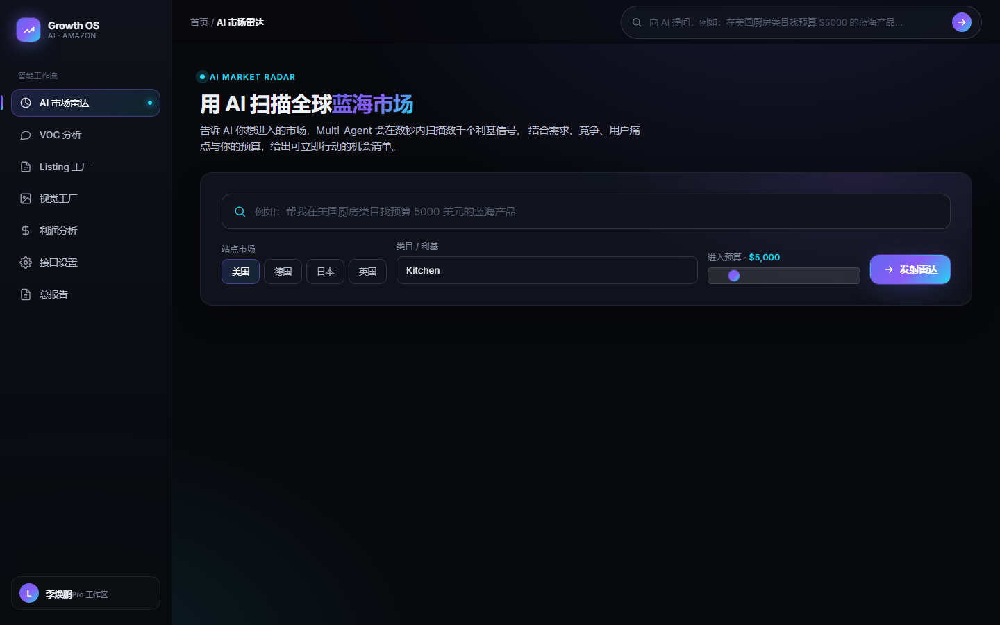

# Amazon AI Growth OS — 完整版 AI 增长操作系统

<p align="center">
  
</p>

面向 Amazon 卖家的 **AI 增长操作系统**。以 **Multi-Agent 架构** 串联完整的增长管道：

```
发现产品 → 分析机会 → 设计产品 → 生成页面 → 投放广告 → 优化增长
```

**Supervisor Agent** 理解用户自然语言需求，判断意图并派发 **9 个**独立专家 Agent；
**产品生命周期管理（增长看板）** 把产品沿六阶段管道推进，每阶段调用对应 Agent 产出制品并评分。

**语言规则（欧美站点）**：目标市场覆盖欧美主要国家（US/UK/DE/FR/IT/ES 等），因此所有面向
买家的 Amazon 内容——**Listing 文案（标题/五点/详情/搜索词/合规提示）与广告分析文案（指标标签/
总结/预算建议/动作理由）一律输出全英文**。输入可为中文，由 Agnes AI 翻译为地道英文（配置
`AGNES_API_KEY` 后生效）；未配置时由内置中英词表做确定性兜底翻译，保证无 Key 也输出英文。

## Agent 架构

```
用户自然语言
     │
     ▼
┌──────────────────────────────────┐
│  Supervisor Agent（总控）          │  意图判断 + 参数抽取 + 派发
└──────────────────────────────────┘
     │  call_*_agent
     ├──┬──────┬──────┬──────┬──────┬──────┬──────┬──────────┐
     ▼  ▼      ▼      ▼      ▼      ▼      ▼      ▼          ▼      ▼
 Market  Competitor VOC Product Listing Image Advertising Lifecycle Visual
发现产品  分析机会        设计产品 生成页面 图片生成 投放广告   优化增长(看板) 商品视觉
```

## 每个 Agent 独立（目录隔离，均含 4 要素）

| Agent | 目录 | 阶段 | tool 接口 |
|---|---|---|---|
| Supervisor | `agents/supervisor/` | 总控 | tools.py（8 个专家 Agent 作为可调用工具）|
| Market | `agents/market/` | 发现产品 | `search_market` |
| Competitor | `agents/competitor/` | 分析机会 | `scan_competitors` |
| VOC | `agents/voc/` | 分析机会 | `fetch_reviews` |
| Product | `agents/product/` | 设计产品 | `score_opportunity` |
| Listing | `agents/listing/` | 生成页面 | `generate_listing` · `build_image_plan` |
| Image | `agents/image/` | 生成页面 | `plan_images` |
| Visual | `agents/visual_agent/` | 商品视觉 | `generate_visual_strategy` · `plan_listing_images` · `generate_images_via_tool` · `score_image_quality` |
| Advertising | `agents/advertising/` | 投放广告 | `analyze_ads` |

每个 Agent 目录固定包含：`prompt.py`（系统提示词）、`schemas.py`（输入/输出 Schema）、
`tools.py`（工具接口：name/description/input_schema(JSON)/handler）、`agent.py`（执行器）。

## 六阶段增长管道（产品生命周期管理）

```
backend/app/lifecycle/   models.py（growth_products + stage_artifacts）· schemas.py · service.py（编排）
```

每阶段由 `service.advance()` 调用对应 Agent 产出制品并评分，产品沿管道逐步推进：

| 阶段 | 调用 Agent | 制品 | 评分 |
|---|---|---|---|
| 发现产品 discover | Market Agent | 市场规模/竞争/机会评分 | opportunity_score |
| 分析机会 analyze | VOC Agent | 痛点排序 + 改进建议 | 痛点覆盖度 |
| 设计产品 design | Product Agent | 是否值得做 + 推荐定位 | opportunity_score |
| 生成页面 build | Listing Agent | 标题/五点/详情/关键词 + 图片方案 | 完整度 |
| 投放广告 advertise | Advertising Agent | 指标 + 广告动作 + 预算建议 | 广告效率 |
| 优化增长 optimize | 聚合 | 综合健康度 + 下一步动作 | overall_health |

`overall_health` = 各阶段已完成制品分数的均值，全程可追溯。

## 技术栈
- 后端：FastAPI + SQLAlchemy（SQLite 演示库，生产可切 PostgreSQL+pgvector）
- 编排：Supervisor 确定性路由（可替换为 LLM 分类）+ 独立专家 Agent + 生命周期编排服务
- 数据采集：Research MCP（模拟 Bright Data / Sorftime / Sif，确定性可复现）
- 前端：单页应用（零构建，自然语言 Agent 总控 + 结构化输入 + 增长看板）

## 运行方式
```bash
cd amazon-ai-growth-os/backend
python -m venv .venv && source .venv/bin/activate     # Windows: .venv\Scripts\activate
pip install -r ../requirements.txt
uvicorn app.main:app --host 0.0.0.0 --port 8000 --reload
# 浏览器打开 http://127.0.0.1:8000/
```

## API
- `POST /api/blue-ocean/research`  `{country,category,budget_usd}` → 10 个潜力产品（Market Agent，落库）
- `POST /api/agent/run`            `{query}` → Supervisor 意图路由（market/competitor/voc/product/listing/image/visual/advertising/lifecycle）
- `POST /api/agent/listing`        `{product_name,niche_keyword,key_features,tone}` → 高转化 Listing + 图片方案
- `POST /api/agent/image`          `{product_name,niche_keyword,count,...}` → 电商视觉方案 + 构图策略
- `POST /api/agent/visual`         `{product_name,niche_keyword,market_positioning,voc_pain_points,competitor_insights,style,country}` → 策略优先：视觉策略 + 7 图规划 + Prompt + 生成请求 + 质量评分
- `POST /api/agent/advertising`    `{product_name,niche_keyword,country,budget_usd}` → 广告分析 + 优化动作
- `POST /api/lifecycle`            `{name,niche_keyword,country,budget_usd}` → 新建增长产品（从「发现」开始）
- `GET  /api/lifecycle`            → 全部增长产品看板
- `GET  /api/lifecycle/{id}`       → 单产品六阶段看板
- `POST /api/lifecycle/{id}/advance` → 推进当前阶段（调用 Agent 产出制品并评分）
- `GET  /api/lifecycle/{id}/artifact/{stage}` → 某阶段结构化制品
- `GET  /api/blue-ocean/tasks/{id}` · `GET /api/tools` / `GET|POST /api/tools/{name}` · `GET /api/health`

## 目录结构
```
backend/app/
├── main.py / config.py / database.py / models.py / schemas.py
├── routers/   blue_ocean.py · agent.py（Supervisor + Agent 直调）· tools.py · lifecycle.py
├── agents/
│   ├── supervisor/  market/  competitor/  voc/  product/   （4 要素/目录）
│   ├── listing/     （生成页面：文案 + 图片方案）
│   ├── image/       （图片生成：视觉策划）
│   ├── visual_agent/（商品视觉：策略优先 → 7 图规划 + Prompt + 生成请求 + 质量评分）
│   └── advertising/ （投放广告：PPC 分析）
├── lifecycle/  models.py · schemas.py · service.py（六阶段编排）
├── tools/      base.py · registry.py · settings.py + 4 个工具目录（amazon_research/voc_analysis/market_search/image_generation）
└── mcp/        research_mcp.py（数据采集，模拟真实数据源）
frontend/index.html  # 单页前端（7 个页面）
```

## 前端（AI SaaS 体验，零构建）

定位 AI SaaS 产品（参考 Perplexity / Linear / Notion AI），暗色极简、突出 AI 交互，非后台管理风格。
客户端 hash 路由 7 个页面，由 FastAPI 在 `/` 托管 `index.html`、静态资源经 `/static/assets/` 提供。
顶部全局命令栏走 Supervisor 总控，自然语言一句话即可在 9 个 Agent 间路由。

| 路由 | 页面 | 数据来源 |
|---|---|---|
| `#/` | AI 市场雷达（自然语言/结构化输入 → 雷达扫描 → 极坐标图）| `POST /api/blue-ocean/research` |
| `#/opportunity` | 产品机会报告（AI 洞察 + 10 产品卡 + 详情雷达）| sessionStorage + 雷达结果 |
| `#/voc` | VOC 分析（痛点严重度 + 改进建议）| `POST /api/tools/voc_analysis` |
| `#/listing` | Listing 工厂（真实 Listing Agent：标题/五点/详情/关键词 + 图片方案）| `POST /api/agent/listing` · `POST /api/agent/image` |
| `#/ads` | 广告分析（真实 Advertising Agent：ACOS/ROAS 指标 + 可执行动作 + 预算建议）| `POST /api/agent/advertising` |
| `#/visual` | AI 商品视觉工厂（Product Visual Agent：策略优先 → 主图策略 + 7 图规划 + 每张 Prompt + 生成请求 + 质量评分 + 优化建议；支持从 VOC/竞品自动填充）| `POST /api/agent/visual` · `POST /api/tools/voc_analysis`（自动填充）|
| `#/lifecycle` | 增长看板（六阶段管道 + 制品评分 + 执行下一步）| `POST/GET /api/lifecycle` · `POST /api/lifecycle/{id}/advance` |

文件：`frontend/index.html` · `frontend/assets/css/styles.css` · `frontend/assets/js/{api,visuals,views,app}.js`

## 评分逻辑（Market / Product 共用）
机会评分 = 0.35×需求强度 + 0.30×蓝海程度 + 0.20×痛点强度 + 0.15×预算适配（均 0-100）。
所有子分可解释，原始信号（`source_signals`）一并入库便于复盘。

---

## MCP Tool 层（外部开源能力封装）

为接入外部开源能力（Bright Data / Sorftime / Sif / easy-amazon-voc / ecom-details-image 等），
新增 **模块化 Tool 层**，遵循三条原则：**不复制源码、模块化封装、保留替换能力**。

```
backend/app/tools/
├── base.py        # BackendType(mock/mcp/api/local_model) · ToolBackend 适配器 · BaseTool 抽象类
├── registry.py    # ToolRegistry：注册 / 按配置选后端 / 输出 JSON Schema 契约
├── settings.py    # 每个工具的后端选择（环境变量可覆盖）
├── amazon_research/   schemas.py · tool.py · backends.py · __init__.py
├── voc_analysis/      schemas.py · tool.py · backends.py · __init__.py
├── market_search/     schemas.py · tool.py · backends.py · __init__.py
└── image_generation/  schemas.py · tool.py · backends.py · __init__.py
```

每个工具目录固定 4 个文件：
- `schemas.py` —— 输入/输出 **JSON 契约**（Pydantic → JSON Schema）
- `tool.py` —— 工具定义（name / description / 注册的 `_backends`）
- `backends.py` —— 后端适配器：`Mock*`（组合复用现有能力，离线可演示）/ `Mcp*`（未来接 MCP Server）/
  `Api*`（未来接 REST API）/ `LocalModel*`（未来接本地模型）
- `__init__.py` —— 导入即注册到 `ToolRegistry`

**替换能力**：同一个工具可在 `mock / mcp / api / local_model` 间切换，仅改环境变量（如
`TOOL_BACKEND_AMAZON_RESEARCH=mcp`），**调用方（Agent）代码零改动**。各「未来后端」已留接口骨架，
接入真实数据源时只实现 `execute()`，不复制外部仓库源码。

### Tool 层 API
- `GET  /api/tools`                    列出全部工具及其 JSON Schema 契约
- `GET  /api/tools/{name}`             查看单个工具契约
- `POST /api/tools/{name}`             `{"input": {...}, "backend?": "mock"}` → 执行并返回 output JSON

### 当前 4 个工具
| 工具 | 输入 | 输出 | 已就绪后端 | 未来可替换 |
|---|---|---|---|---|
| `amazon_research` | 国家/类目/预算/top_n | Top-N 潜力产品（规模/竞争/痛点/评分/建议）| mock | mcp(Bright Data/Sorftime/Sif) · api(SellerSprite) |
| `market_search` | 国家/类目/pool_size | 候选利基原始信号 | mock | mcp(Bright Data deep research) · api(Google Trends) |
| `voc_analysis` | 利基/国家/ASIN/top_n | Top-N 用户痛点+改进建议+总结 | mock | mcp(easy-amazon-voc) · 本地模型 |
| `image_generation` | 产品/利基/风格/数量/平台 | 多场景图片方案 | mock（默认）· **api(WisArt 文生图)** | 本地模型(SDXL) · mcp(ecom-details-image) |

## 真实 API 接入（Agnes 文本 + WisArt 生图）

系统默认走 mock / 启发式，**开箱即用、无需密钥**。设环境变量即切换到真实大模型，调用方（Agent）代码零改动。

### 配置写在哪（推荐用 `.env`）
所有接口均为**环境变量**，无需改代码。项目用零依赖的 `.env` 加载器（见 `backend/app/main.py` 的 `_load_env_file`），启动时会自动读取项目根目录的 `.env`。

1. 复制示例：`cp .env.example .env`（或在项目根目录新建 `.env`）
2. 填入密钥（见下方各接口对应变量）
3. **重启后端**（`uvicorn` 进程）使配置生效——因为 Agnes 与后端选择都在模块加载时读一次环境变量。

> 无 `.env` 时系统自动跳过、走 mock / 启发式，不影响启动。

### 前端设置界面（推荐方式 · `#/settings`）
除了手改 `.env`，系统提供**前端设置页**（侧边栏「接口设置」）：在浏览器里直接配置 / 切换模型与后端，**保存后即时生效，无需重启**，配置同时写回 `.env` 持久化。
- 文本 AI（Agnes）：API Key、Base URL、文本模型、图像模型、超时——可切换模型 ID 并「测试连接」验证连通性。
- 图像生成（WisArt）：后端开关（mock / api）、API Key、Base URL、文生图路径、鉴权头名、异步任务开关——「测试连接」验证生图后端是否可路由。
- 其它工具后端：市场研究 / VOC / 选品信号 的 mock / mcp / api 切换。
- 后端支撑：`GET/PUT /api/settings`（分组返回、密钥脱敏、运行时可变）、`POST /api/settings/test`（连通性验证）；运行时配置存储见 `backend/app/config_store.py`，Agent / 工具在**调用时**读取它，因此改配置无需重启。

### 文本 AI —— Agnes AI（Visual Agent 视觉策略）
- 文档：https://www.agnes-ai.com/zh-Hans/docs/overview ｜ OpenAI 兼容（Base URL `https://apihub.agnes-ai.com/v1`，`Authorization: Bearer <KEY>`）
- 设 `AGNES_API_KEY` 后，Visual Agent 的「视觉策略」自动改由 Agnes 真实文本模型生成（定位/VOC/竞品 → 结构化 JSON 策略）；未设置或调用异常时**自动回退启发式**，保证始终可用。
- 可选：`AGNES_BASE_URL` / `AGNES_TEXT_MODEL`（按 Agnes 控制台真实模型 ID 调整）/ `AGNES_IMAGE_MODEL` / `AGNES_TIMEOUT`。

### 图像生成 —— WisArt 文生图（智画创）
- 文档（会员登录后）：https://wisart.kuaileshifu.com/#/member/api-docs
- 开启：`export TOOL_BACKEND_IMAGE_GENERATION=api` 并设 `WISART_API_KEY=xxx`。
- 后端按 OpenAI 兼容约定实现：`POST {WISART_BASE_URL}{WISART_ENDPOINT}`，`Bearer` 鉴权，返回 `data[].url` / `b64_json`，覆盖大多数合规 WisArt 端点。
- 可选：`WISART_BASE_URL`（默认 `https://wisart.kuaileshifu.com/api`）/ `WISART_ENDPOINT`（默认 `/v1/images/generations`）/ `WISART_AUTH_SCHEME`（默认 `Bearer`，支持 `X-API-Key` 等）。
- 若 WisArt 为「异步任务」接口（submit 拿 task_id 再 query 拿图），设 `WISART_ASYNC=1` 并补全 `ApiImageGenBackend._wisart_call_async()`（见 `backends.py` 注释）。
